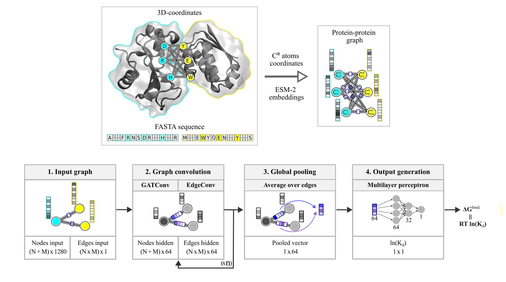

<div align="justify">

# PCANN - Protein Complex Affinity Neural Network

<p align="center">
  
</p>

This repository contains the scripts, trained models and sample data to predict the binding free energy of a protein-protein complex based on its 3D-coordinates. 
The package includes 25 models, whose results are averaged to obtain the prediction for $$∆G^{bind}$$

### System requirements

Key packages and programs:

- Linux platform (tested on ubuntu 20.04 and ubuntu 22.04)
- [python3](https://www.python.org/) (tested with python3.9)

### Installation dependencies

Install all dependencies except for PyTorch and PyTorch Geometric.

```code-block:: bash
# create virtual enviroment
python3.9 -m venv ./venv
source ./venv/bin/activate
pip install --upgrade pip
pip install -U setuptools wheel pip

# install python packages
pip install -r requirements.txt

# install PCANN in PYTHONPATH
python setup.py install

# download pretrained esm model
cd trained_models/ESM-2/
bash download.sh
```

Note! Due to the variations in GPU types and drivers, we are unable to make one environment that will run on all systems. 
As such, we provide only the file ```requirements.txt``` with support for CUDA 11.3, leaving it to a user to customize this file.
The customization involves changing the cudatoolkit, PyTorch version and python version in ```requirements.txt```


### Make predictions. Example

We provide the templates to make predictions in [examples/make_predictions/](examples/make_predictions/)
Please, change ```path_to_dimer_pdb``` parameter in [examples/make_predictions/load.py](examples/make_predictions/load.py) to point at the PDB structure (protein-protein complex) of interest

```code-block:: bash
   # run the script to make predictions
   cd examples/make_predictions/
   python load.py
```
See the expected result in [examples_output/make_predictions/](examples_output/make_predictions/)
Predictions from the 25 PCANN models along with the averaged result can be found in [examples_out/make_predictions/output/output.csv](examples_out/make_predictions/output/output.csv).
We recommended to use the PCANN(avg) scheme

### Run training and testing. Example

In a way of a demo, we provide the template to train and test the PCANN model

```code-block:: bash
   # run the script to train and test PCANN 
   cd examples_out/run_training
   python run_train.py
   python run_training/run_test.py
```

</div>